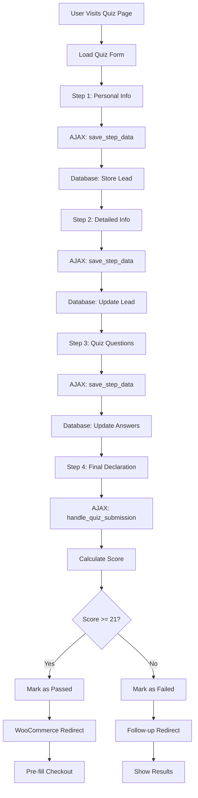

# ACF Quiz System - System Architecture

## 🏗️ System Overview

The ACF Quiz System is a comprehensive WordPress plugin that provides a multi-step Hebrew quiz with WooCommerce integration. The system is designed for high reliability and includes multiple fallback mechanisms for critical operations.

## 📋 Core Architecture

### 1. Plugin Structure

```
acf-calculator-form.php (Main Plugin File)
├── ACF_Quiz_System (Main Class)
│   ├── Constructor & Initialization
│   ├── WordPress Hooks Registration
│   ├── ACF Field Registration
│   ├── Database Table Creation
│   └── Asset Management
│
├── AJAX Handlers
│   ├── handle_step_data() - Step progression
│   ├── handle_quiz_submission() - Final submission
│   ├── simple_lead_capture() - Fallback lead capture
│   └── save_step_data() - Session storage
│
├── WooCommerce Integration
│   ├── create_quiz_products() - Dynamic product creation
│   ├── populate_checkout_fields() - Pre-fill checkout
│   ├── handle_custom_cart_item() - Cart customization
│   └── set_custom_cart_item_price() - Price management
│
├── Admin Interface
│   ├── add_options_page() - ACF settings page
│   ├── add_submissions_page() - Submissions dashboard
│   └── enqueue_admin_assets() - Admin styling/scripts
│
└── Frontend Components
    ├── render_quiz_form() - HTML form generation
    ├── enqueue_public_assets() - CSS/JS loading
    └── Shortcode processing
```

### 2. Data Flow Architecture



## 🔧 Technical Components

### Frontend Architecture

#### JavaScript Modules (`js/quiz-public.js`)

**MultiStepQuiz Object:**
```javascript
{
    // Properties
    form: $('#acf-quiz-form'),
    currentStep: 1,
    totalSteps: 4,
    stepData: {},
    isSubmitting: false,

    // Core Methods
    init(): Initialize form and event handlers
    validateCurrentStep(): Validate current step fields
    showStep(stepNumber): Display specific step
    handleNextStep(): Process step progression
    handleSubmit(): Process final submission

    // AJAX Methods
    submitForm(): Send quiz data to server
    saveCurrentStepData(): Store step data in session
    storeFinalSubmission(): Store final results
    handleQuizResults(): Process submission response
}
```

#### CSS Architecture (`css/quiz-public.css`)

**Key CSS Classes:**
- `.acf-quiz-container` - Main container with RTL support
- `.form-step` - Individual step containers
- `.form-step.active` - Currently visible step
- `.field-input` - Form input fields with validation states
- `.field-input.error` - Invalid field styling
- `.field-input.touched` - User-interacted fields
- `.nav-btn` - Navigation buttons (next/prev/submit)

### Backend Architecture

#### PHP Class Structure

**ACF_Quiz_System Class:**

**Properties:**
- `$instance` - Singleton instance
- `$plugin_url` - Plugin URL path
- `$plugin_path` - Plugin filesystem path

**Initialization Methods:**
- `get_instance()` - Singleton accessor
- `__construct()` - Constructor with dependency checks
- `init_hooks()` - Register WordPress hooks

**WordPress Integration:**
- `add_shortcode('acf_quiz')` - Register shortcode
- `wp_ajax_*` actions - AJAX endpoint registration
- `acf/init` action - ACF field registration

#### Database Architecture

**Table: `wp_quiz_submissions`**

**Schema:**
```sql
CREATE TABLE wp_quiz_submissions (
    id mediumint(9) NOT NULL AUTO_INCREMENT,

    -- Personal Information (Step 1)
    first_name varchar(100) NOT NULL,
    last_name varchar(100) NOT NULL,
    user_phone varchar(20) NOT NULL,
    user_email varchar(100) NOT NULL,

    -- Detailed Information (Step 2)
    id_number varchar(20) DEFAULT '',
    gender varchar(10) DEFAULT '',
    birth_date date DEFAULT NULL,
    citizenship varchar(50) DEFAULT 'ישראלית',
    address text DEFAULT '',
    marital_status varchar(20) DEFAULT '',
    employment_status varchar(50) DEFAULT '',
    education varchar(50) DEFAULT '',
    profession varchar(100) DEFAULT '',

    -- Legacy compatibility
    user_name varchar(100) DEFAULT '',
    contact_consent tinyint(1) DEFAULT 0,

    -- Package information
    package_name varchar(100) DEFAULT '',
    package_price decimal(10,2) DEFAULT 0.00,
    package_source varchar(100) DEFAULT '',

    -- Quiz results
    answers longtext NOT NULL,
    score int(11) NOT NULL,
    max_score int(11) NOT NULL,
    score_percentage decimal(5,2) NOT NULL,
    passed tinyint(1) NOT NULL,

    -- Completion tracking
    current_step int(1) DEFAULT 1,
    completed tinyint(1) DEFAULT 0,
    declaration_accepted tinyint(1) DEFAULT 0,

    -- Metadata
    submission_time datetime DEFAULT CURRENT_TIMESTAMP,
    ip_address varchar(45) DEFAULT '',
    user_agent text DEFAULT '',

    PRIMARY KEY (id),
    KEY passed (passed),
    KEY completed (completed),
    KEY submission_time (submission_time),
    KEY user_email (user_email)
);
```

### AJAX Architecture

#### Endpoint Mapping

| Endpoint | Method | Purpose | Security |
|----------|--------|---------|----------|
| `wp_ajax_save_step_data` | POST | Store step data | Nonce verification |
| `wp_ajax_handle_quiz_submission` | POST | Process final submission | Nonce verification |
| `wp_ajax_simple_lead_capture` | POST | Fallback lead capture | Nonce verification |
| `wp_ajax_submit_quiz` | POST | Legacy submission endpoint | Nonce verification |

#### Data Flow Patterns

**Step Data Storage:**
```javascript
// Client sends
{
    action: 'save_step_data',
    quiz_nonce: nonce,
    current_step: stepNumber,
    step_data: {
        first_name: 'John',
        last_name: 'Doe',
        // ... step fields
    }
}

// Server processes and stores in session/database
```

**Final Submission:**
```javascript
// Client sends complete quiz data
{
    action: 'handle_quiz_submission',
    quiz_nonce: nonce,
    quiz_data: {
        // All form data
        answers: {...},
        personal_info: {...}
    }
}

// Server calculates score and redirects
```

## 🔄 Data Processing Flow

### 1. Form Initialization
1. Shortcode `[acf_quiz]` renders form HTML
2. JavaScript `MultiStepQuiz.init()` initializes event handlers
3. ACF fields populate form content
4. CSS applies RTL styling and responsive design

### 2. Step Progression
1. User fills Step 1 fields
2. `validateCurrentStep()` checks required fields
3. AJAX call to `save_step_data` stores data
4. `showStep(2)` displays next step
5. Process repeats for Steps 2-4

### 3. Final Submission
1. User completes Step 4 and accepts declaration
2. `handleSubmit()` prevents default form submission
3. AJAX call to `handle_quiz_submission` processes data
4. Score calculation (21+ points = pass)
5. WooCommerce redirect or follow-up based on result

### 4. WooCommerce Integration
1. Dynamic product creation if needed
2. Cart population with quiz data
3. Checkout field pre-filling
4. Order completion with lead data

## 🛡️ Error Handling Architecture

### Client-Side Error Handling
- Field validation with visual feedback
- AJAX error recovery with retry mechanisms
- User-friendly error messages in Hebrew
- Progressive enhancement (works without JavaScript)

### Server-Side Error Handling
- WordPress error logging
- AJAX error responses with fallback options
- Database transaction safety
- Graceful degradation for missing dependencies

### Fallback Systems
1. **Lead Capture**: Primary AJAX → Fallback direct PHP
2. **Product IDs**: Dynamic lookup → Fallback to shop
3. **Session Data**: WordPress sessions → Database storage
4. **AJAX Calls**: Primary endpoint → Alternative endpoint

## 📊 Performance Architecture

### Optimization Strategies
- **Asset Loading**: Conditional CSS/JS loading
- **Database**: Indexed queries with prepared statements
- **AJAX**: Minimal data transfer, efficient serialization
- **Caching**: WordPress object caching for repeated data

### Monitoring Points
- Database query performance
- AJAX response times
- Memory usage during processing
- Error rate tracking

## 🔒 Security Architecture

### Input Validation
- WordPress `sanitize_text_field()` for all inputs
- Email validation with `is_email()`
- SQL injection prevention with prepared statements
- XSS prevention with `esc_html()` and `esc_attr()`

### Access Control
- Nonce verification for all AJAX calls
- Capability checks for admin functions
- File upload restrictions
- Direct access prevention

### Data Protection
- Sensitive data encryption in transit
- Secure session handling
- Audit trail logging
- GDPR compliance considerations
